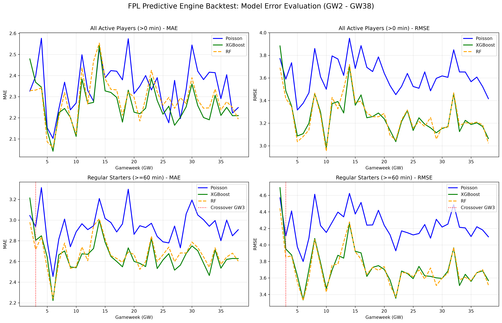

# FPL Predictive Engine: ML vs. Poisson Backtest


## Project Overview
This repository contains a robust Data Science pipeline and backtesting engine for predicting Fantasy Premier League (FPL) expected points (xP). The project evaluates the crossover point where Machine Learning algorithms (XGBoost, Random Forest) begin to outperform a traditional statistical Poisson-based baseline across a 38-gameweek season. 

The core focus of this project is strict **data leakage prevention** using an expanding window backtest approach and rolling feature engineering.

## Domain Context: How FPL Works
If you are unfamiliar with Fantasy Premier League, it is a game where managers build virtual teams of real-life Premier League footballers. 
The objective of this machine learning model is to predict **Expected Points (xP)**. Players score real points based on their on-pitch performances:
* **Minutes Played:** Points for appearances (starting or coming off the bench).
* **Attacking Returns:** High points for scoring goals and providing assists.
* **Defensive Returns:** Points awarded to Goalkeepers and Defenders for keeping a "Clean Sheet" (not conceding any goals).
* **Other Actions:** Saves, bonus points, and defensive contributions.

Accurately forecasting these points requires balancing historical player stats (xG, xA) with opponent strength and expected playing time (xMin).

## Methodology & Architecture

1. **Expanding Window Backtest (GW2 - GW38):** Models are strictly trained on data available *prior* to the target gameweek to simulate real-world forecasting and prevent data leakage.
2. **Feature Engineering:** 
   * Computed 3-GW and 5-GW rolling averages for minutes, starts, and expected metrics (xG, xA, xGC).
   * Developed a custom `predict_xmin` heuristic to estimate expected playing time based on recent rotation patterns.
3. **Model Candidates:**
   * **Poisson Baseline:** Uses team expected goals and individual player xG/xA shares to estimate probabilities of attacking/defensive returns.
   * **XGBoost Regressor:** A gradient boosting model using positional one-hot encoding and rolling features.
   * **Random Forest Regressor:** A robust ensemble baseline.

## Experiment Results & Insights

The backtest evaluated the Mean Absolute Error (MAE) and Root Mean Squared Error (RMSE) for all active players (minutes > 0) and regular starters (minutes >= 60).

**Summary of MAE (GW2 - GW38):**
| Model | All Active Players (>0 min) | Regular Starters (>=60 min) |
| :--- | :---: | :---: |
| **Poisson Baseline** | 2.3500 | 2.9391 |
| **XGBoost** | **2.2628** | **2.6575** |
| **Random Forest** | 2.2876 | 2.6757 |

### Key Insight: The Crossover Point
While the statistical Poisson model is competitive early in the season, the experiment revealed a decisive **crossover point at Gameweek 3**. Starting from GW3, the **XGBoost** model gathers enough rolling data to consistently outperform the Poisson baseline for regular starters. 



## Repository Structure
```text
.
├── run_backtest.py                 # Main execution script and evaluation loop
├── requirements.txt                # Dependency requirements
├── .env.example                    # Environment variables
├── .gitignore                      # Git exclusion rules
├── README.md                       # Project documentation
│
├── data/
│   └── merged_gw.csv               # Raw gameweek dataset
│
├── outputs/
│   ├── backtest_metrics_summary.csv # Exported evaluation metrics
│   └── backtest_performance_comparison.png # Matplotlib visualization
│
└── src/
    ├── loader.py                   # Data ingestion, cleaning, and rolling feature generation
    └── models.py                   # ML pipelines, Poisson calculations, and positional encoding

```

## How to Run
```bash
# Clone the repository
git clone https://github.com/piotrjsk/fpl-backtest-engine.git
cd fpl-backtest-engine

# Install dependencies
pip install -r requirements.txt

# Execute the backtest pipeline
python run_backtest.py
```

---
*Developed by Piotr Jasiak | [LinkedIn Profile](https://www.linkedin.com/in/piotrjasiak)*